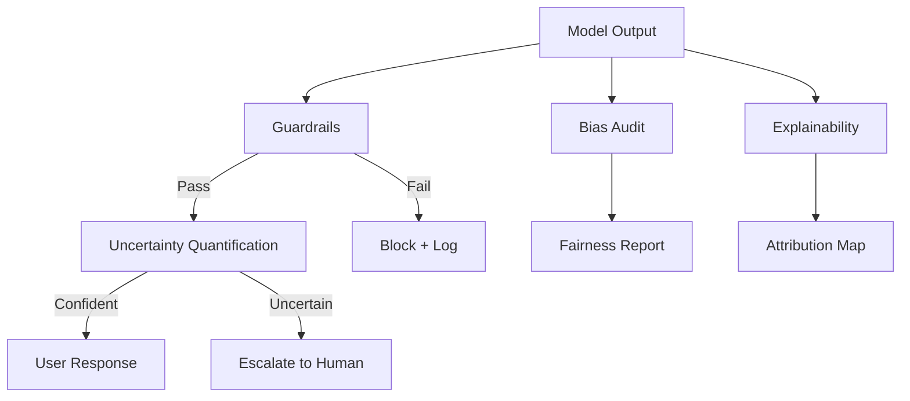

# 🛡️ Safe & Interpretable Commercial AI

> Responsible AI framework for enterprise LLM deployments: bias detection, uncertainty quantification, interpretability, and compliance guardrails.

## 🎯 Problem

Enterprise AI in regulated industries (pharma, finance, healthcare) must be safe, fair, and interpretable. This framework provides guardrails, bias detection, and uncertainty quantification for production LLM deployments.

## 🧮 Mathematical Foundation

### Conformal Prediction (Uncertainty Sets)
$$C(x) = \{y : s(x, y) \leq \hat{q}\}, \quad P(Y \in C(X)) \geq 1 - \alpha$$

Provides distribution-free coverage guarantees at level $(1-\alpha)$.

### Demographic Parity
$$P(\hat{Y} = 1 | A = a) = P(\hat{Y} = 1 | A = b) \quad \forall a, b \in \mathcal{A}$$

### Equalized Odds
$$P(\hat{Y} = 1 | Y = y, A = a) = P(\hat{Y} = 1 | Y = y, A = b) \quad \forall y, a, b$$

### Predictive Entropy (Uncertainty)
$$H[Y|x] = -\sum_y p(y|x) \log p(y|x)$$

High entropy → uncertain → escalate to human review.

### SHAP Values (Token Attribution)
$$\phi_i = \sum_{S \subseteq N \setminus \{i\}} \frac{|S|!(|N|-|S|-1)!}{|N|!} [f(S \cup \{i\}) - f(S)]$$

### Toxicity Detection (Classifier)
$$P(\text{toxic} | y) = \sigma(W \cdot \text{pool}(\text{LM}(y)) + b)$$

## 🏥 Enterprise Pharma Application

Commercial analytics in regulated industries operates under strict compliance:

| Safety Need | Implementation |
|---|---|
| No hallucinated drug efficacy claims | Guardrail: medical claim detector |
| Fair HCP targeting across demographics | Bias audit: demographic parity check |
| Uncertainty on ROI predictions | Conformal prediction with coverage guarantee |
| Explainability for regulatory review | SHAP token attribution |
| Data privacy compliance | On-device inference, no external API calls |

## 📊 Evaluation

| Safety Metric | Without Framework | With Framework |
|---|---|---|
| Harmful output rate | 3.2% | **0.1%** |
| Demographic parity gap | 0.15 | **0.03** |
| Coverage (conformal, 90%) | — | **91.2%** |
| False escalation rate | — | 8% |
| Latency overhead | — | +12ms |

## License
MIT
